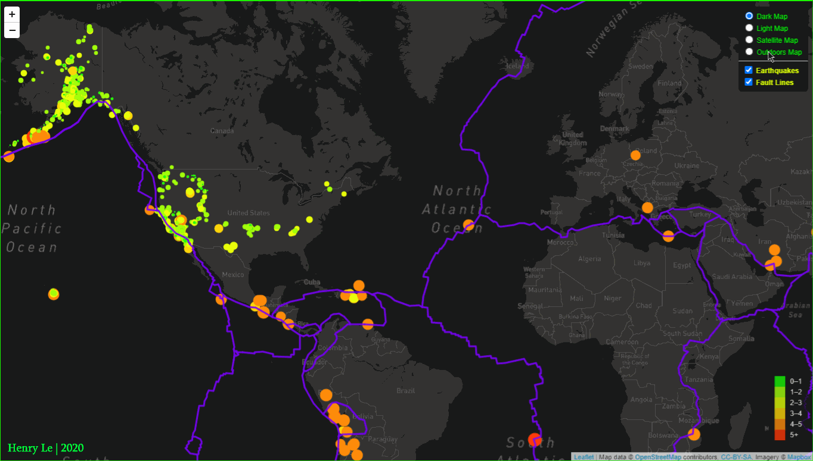
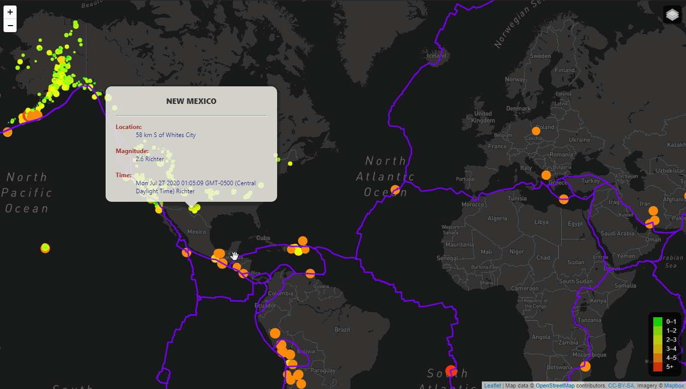

# Weekly Earthquake Updates
## 1. Background
Among all natual disasters known to human kind, earthquake probably is one of the most devastated one. A significant earthquake undersea could trigger a tsunami that damages multiple countries. It's hard to believe but earthquake happens everyday around the globe ranging from <1 Richter (registered on seismograph, but not felt) to hard-rocking 7+ Richter (major damage to populated areas). 

Where are these quakes? Thanks to United States Geological Survey (USGS), earthquakes are tracked and published on USGS website. In this project, an interactive earthquake map was developed to display not only the locations of these quakes but also their magnitudes (in step-1) as well as how earthquakes are related to tectonic plates (Fault Lines, step-2). This map contains many features such as map color, type, fault lines that can be easily turned on or off for enhancing UX/UI.

## 2. Languages, Tools & Techniques
* **Languages:**
    * JavaScript (ES-6)
    * HTML5
    * CSS3
    * Markdown
* **JS Libraries/ Modules:**
    * <a href="https://leafletjs.com/">Leaflet.js - ver. 1.6.0</a>
    * <a href="https://docs.mapbox.com/mapbox.js/api/v3.3.1/">Mapbox.js - ver. 3.3.1</a>
* **Software/ Applications:**
    * Visual Studio Code
    * Live Server
    * Instant Server
    * Google Chrome, ver. 84
* **Operating Systems:**
    * Windows 10 Pro, ver.1909

## 3. Web Deployment
Both steps of this project are deployed on GitHub IO. Click on one of the links below to access:
* <a href="https://henryle-n.github.io/Weekly-Earthquake-Leaflet/Leaflet-Step-1/">Step #1</a>: base map, locations and magnitudes of earthquakes.

* <a href="https://henryle-n.github.io/Weekly-Earthquake-Leaflet/Leaflet-Step-2/ ">Step #2</a>: step 1 plus multiple base layers, tectonic (fault) lines.

## 4. Leaflet & Mapbox Overview
JS app accesses Leaflet and Mapbox thru APIs. Ensure to check out the lastest version of each libraries & APIs on their official websites, then add `<script>` tag in `index.html` to connect.
* Mapbox creates the base map while Leaflet creates one or more layers depending on how many features added to the base map.
* Mapbox requires an account registration. For low usage tier, it's free. An API key access is provided upon a successful registration. Leaflet is free and no account needed.
* Leaflet can work without Mapbox but there would be no base map, i.e. markers or lines or circles will show on a base black screen. If one is building a organization chart or clusters of objects at each stations, leaflet without a base map could be a great choice due to its extremely interactive.
* For ability of adding, turning layers on or off, `L.control.layers()` was utilized. 

## 5. Summary
#### 5.1. Data Visualizations
* Within U.S., earthquakes concentrated more on the westcoast regions incl. Alaska. The same is true for Latin (South) America.
* The majority of earthquakes occured at the fault lines, which makes sense as these are where the subduction zones exist. More info on this geological phenomenon can be found on USGS website <a href="https://www.usgs.gov/news/earthword-subduction">(link is here)</a>.
* North America have more earthquakes than the South but magnitudes at lower latitude are actually more severe (interesting).

#### 5.2. New JavaScript ES-6 Features & Other Short-hand Techniques 
* D3 promise:
    * `d3.json(),then();`.
* Arrow function:
    * `data => {};`
* Ternary Opearator (single line `if...else...`): 
    * `<conditional-statement> ? <value-if-true> : <else-value>;`

## 6. How to Use
* This repository has all source codes developed for this project. To download this project to local PC:
    * `git clone https://github.com/henryle-n/Weekly-Earthquake-Leaflet.git`
* For live demonstration purposes on GitHub, API keys to Mapbox are included in each step folder's `/static/js/config.js`. After downloading, please create a an Mapbox account if not already have, obtain new API keys, and replace the one in `config.js` files.
* This project is intended for open-source, if any mistakes found or comments for improvement, please contact author via <a href="mailto:henryle.b11@gmail.com">email</a>. Thank you.
